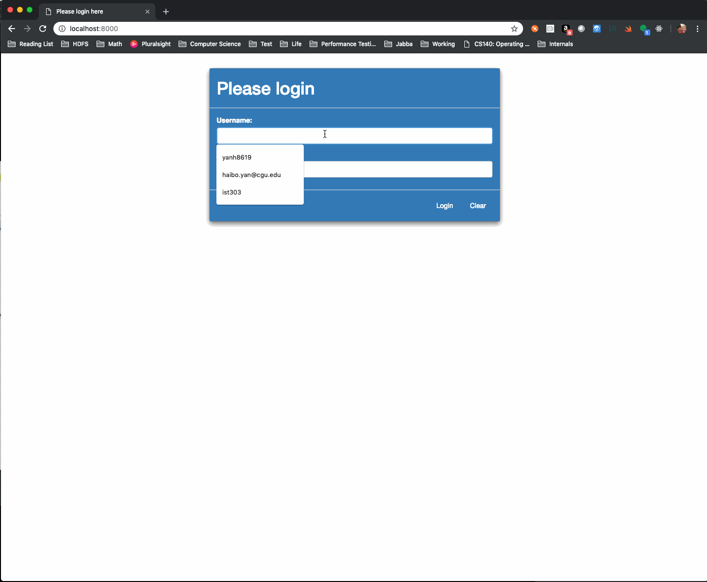

# MiYE

> " Mud in Your Eye” (MiYE) - a new, small hot spring health spa, located in a remote, scenic part of the US. The software must support the spa’s front desk clerks in managing service reservations and statements of service usage for customers.

MiYE is a an application that works for a full-time resort spa facility, provides the front desk clerk the ability to manage services, and customers can also make reservation in the system.
By default, MiYE provides services as follows.

## Video Walkthrough

Here's a walkthrough of implemented user stories:



GIF created with [LiceCap](http://www.cockos.com/licecap/).

## Team Member/Role

* [Karen Snow](https://github.com/karensnow2019) - Business Design, Programmer
* [Okechukwu Ugwuanyi](https://github.com/okechukwuugwuanyi) - UI Design, Programmer
* [Haibo Yan](https://github.com/billyean) - System Design, Programmer

## Design

#### Logic Design

MiYE provides at functions below.

#### Administration

MiYE has two administration pages that provide customers' management and services' management.

#### reservation

MiYE provides a reservation page where the clerk can manage customer reservations and also query customer reservations by given condition

### Architecture

MiYE is a python Django web framework application that can be run in Linux/MacOSX/Window. MiYE is using JQuery to provide AJAX support for implementation of the single page application. MiYE is using sqllite3 as local storage, which means MiYE doesn't support multiple user scenarios.

MiYE is a application where an authorized clerk can manage the system and an authorized manager can edit the system. MiYE provides an initial user creation mechanism to ensure system safety.

MiYE is using both Django rest API to manipulate data, data will be transfer between a customer's browser and MiYE asynchronously.

## Application Preparation

### Start you local environment

* MacOSX/Linux

  ```shell
  # Create a virtual environment and activate it
  $ python3 -m venv venv
  $ source venv/bin/activate
  $ pip install -r requirements.txt
  ```

* Windows

  ```shell
  # Create a virtual environment and activate it
  python -m venv venv
  venv\Scripts\activate
  (venv) pip install -r requirements.txt
  ```

### Prepare your schema and play with it

* Step create your schema
```shell
$ python manage.py makemigrations
$ python manage.py migrate
```

* Play with your data
```shell
$ python manage.py shell_plus --notebook
# This will open a jupyter notebook and you can run it
```

### Create a super user for your application
```shell
$ python manage.py createsuperuser
```

### Run dev server

```shell
$ python manage.py runserver
```

Go to [http://localhost:8000](http://localhost:8000)

### Run production server

> Note: [Gunicorn](https://gunicorn.org) is a Python WSGI HTTP Server, it works as a HTTP gateway for DJango application.

```shell
gunicorn miye.wsgi:application --bind 0.0.0.0:8000 --workers 3
```

### Test

Run pytest

```python
python -m pytest
```

Run pytest with coverage
```python
python -m pytest --cov=administration --cov=report --cov-reservation
```

### Docker

Miye can be run as a docker image, which makes the depolyment process extremely easy.

Build miye docker image and run it
 
```shell
$ docker build -t miye_image .
$ docker run -p 8000:8000 -i -t miye_image
```

## Page Overview

* [X] Login/Logout
* [X] Service administration
* [X] Customer administration
* [ ] Reservation
